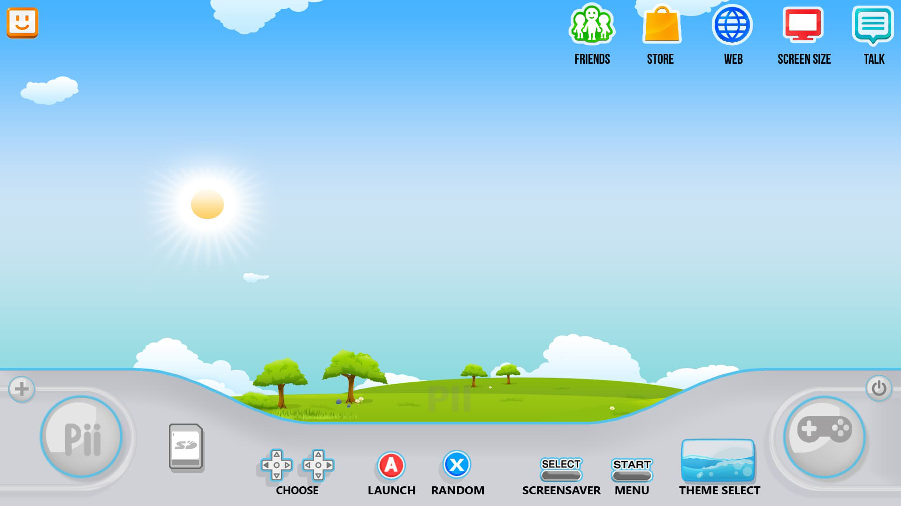
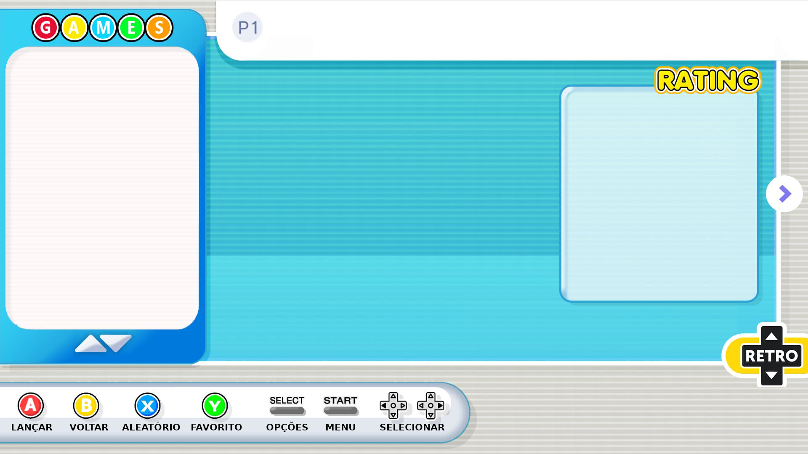
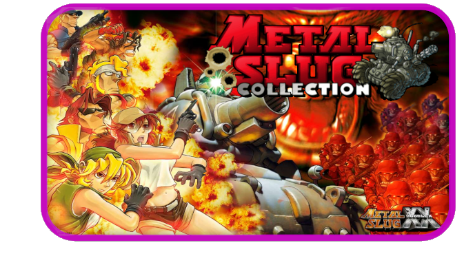
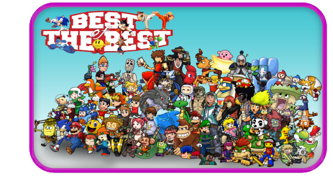

# Esse tema tem um estilo de CARROSSEL é muito bonito e seu nome é Wii PII de autoria do  Will Allen (aka) WAWEEDMAN, que por sua vez foi baseado no Nintendo Wii theme, devidos créditos dados a eles 

#####################################################################################

# Screenshots

Neste tema pegamos original, traduzimos a parte escrita das 2 telas de fundo, refizemos TODOS os botoes de MENU e adicionamos mais de 60 itens  de MENU para que o TEMA torna-se totalmente compatível com todos os packs da Customização JPArcades e consequentemente com o Batocera Comum e com o Batocera Plus. Porém, vale ressaltar que todos os créditos são dos criadores originais e aproveito para agradecer a boa vontade em construir um tema e disponibilizar que outras pessoas possam usar
#####################################################################################

